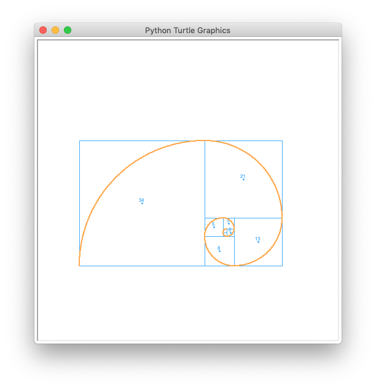
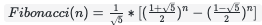
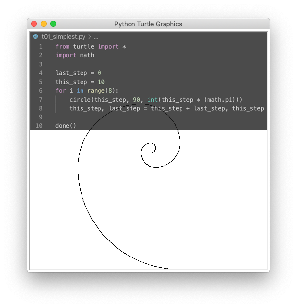
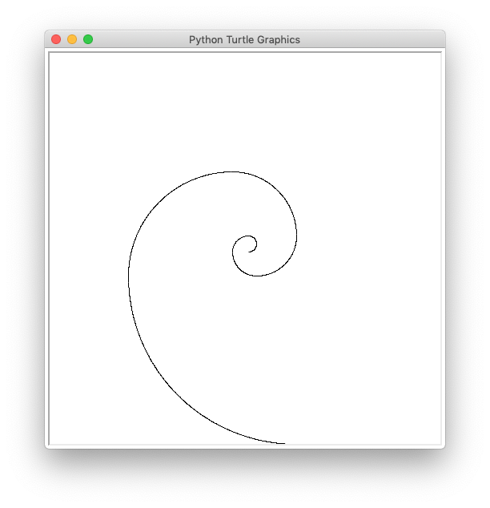
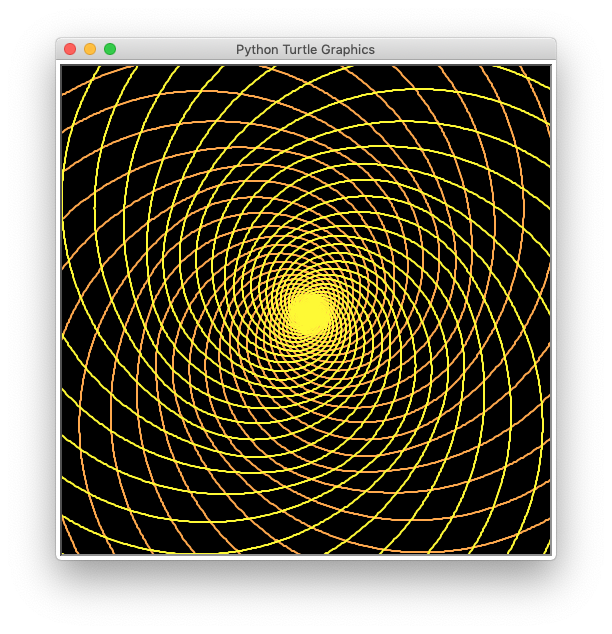
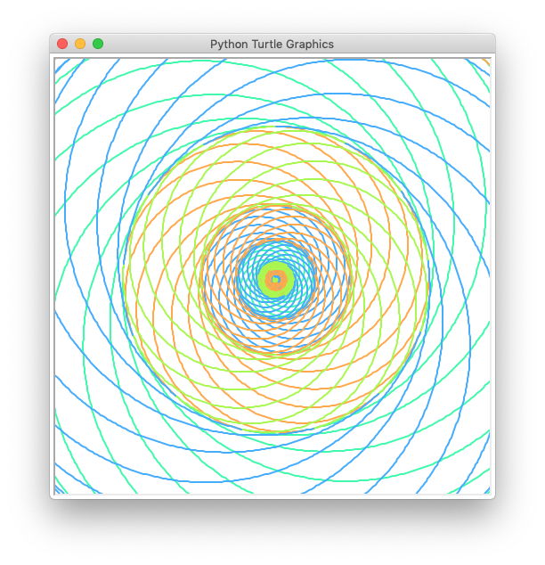
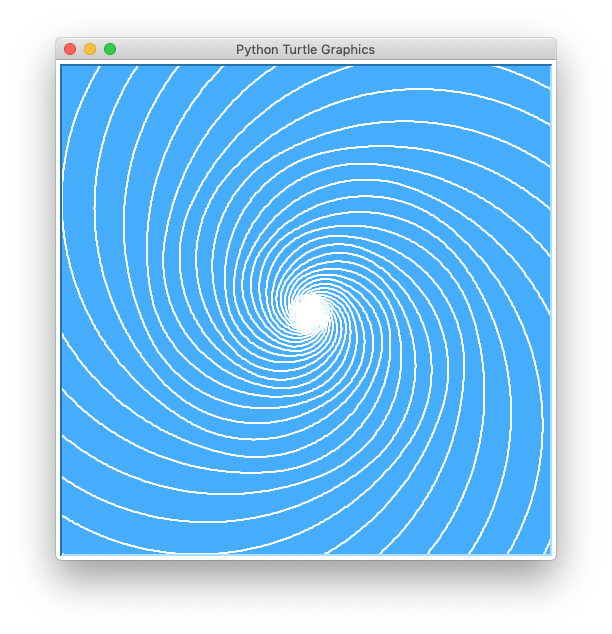
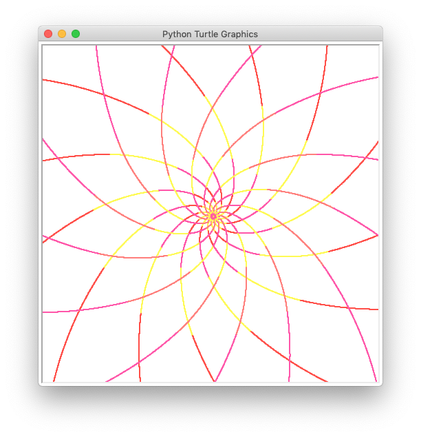

# draw Fibonacci sequence with python



Fibonacci sequence is a magical math tool. 

And it can be compute by formula:



### There are at least two ways to compute a Fibonacci sequence:

#### 1. Compute by formula:

```python

# fibonacci_math.py

def fibonacci(n):
    return  (1/math.sqrt(5))
            *(
                math.pow((1+math.sqrt(5))/2,n)
                -math.pow((1-math.sqrt(5))/2,n)
            )
        )

def fibos(n):
    fibo_list=[]
    for i in range (0,min(n,LIMIT)):
        fibo = fibonacci(i+1)
        fibo_list.append(fibo)
    return fibo_list
```

You can try it by:
```bash
# python fibos.py {n} like this:
python fibonacci_math.py 12
```
#### 2. Compute by loop and puls:

```python
# fibos.py

def fibos(n):
    fibo_list=[]
    last_step = 0
    this_step = 1
    for i in range (0,min(n,LIMIT)):
        fibo = this_step
        fibo_list.append(fibo)
        this_step,last_step = this_step+last_step,this_step
    return fibo_list

```
You can try it by:
```bash
# python fibos.py {n} like this:
python fibos.py 9
```

And you can draw a fibonacci spiral which use only 10 line`s code.



## Tutorials:

### tutorial 01:

The simplest code to draw a fibonacci spiral which use only 10 line`s code.

```bash
python t01_simplest.py
```


### tutorial 02:

Show logic of Fibonacci sequence

```bash
python t02_fibo_bounds.py
```


### tutorial 03:

Show flowers close to Fibonacci sequence

```bash
python t03_fibos_spirals.py 1
```



```bash
python t03_fibos_spirals.py 2
```


```bash
python t03_fibos_spirals.py 3
```



```bash
python t03_fibos_spirals.py 4
```

## Truble shutting:

If you get a error "No module named 'PIL'"
you need to install Pillow

```bash
pip install Pillow
```
